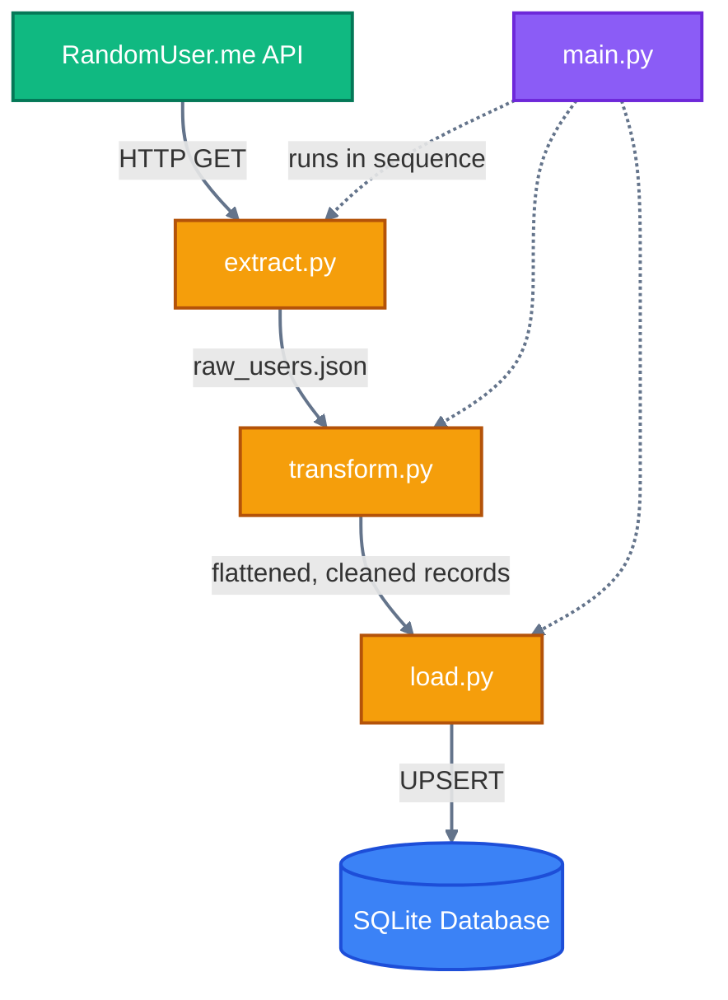

# ETL Pipeline: API to SQL Warehouse

## Overview

This project is a containerized ETL pipeline that pulls user profile data from a live public API, cleans and standardizes it with Python, and loads it into a local SQL warehouse. It was my first data engineering project, built to learn the core extract, transform, load pattern end to end rather than practicing each step in isolation.

Instead of relying on standalone scripts that process local files, the pipeline connects to a real HTTP API, handles the messy nested response it returns, and writes clean, structured records into a database using an idempotent load pattern. The whole thing runs inside Docker so it behaves the same way regardless of the machine it runs on.

## Use case

Raw data from external APIs is rarely ready to use. It arrives nested, inconsistently formatted, and full of fields you don't need. This project simulates a common early stage data engineering task: taking an unreliable external source and turning it into something a database and downstream users can actually rely on, on a repeatable basis rather than a one time script run.

## System Architecture & Data Flow



## Pipeline Breakdown

### 1. Extraction: `pipelines/extract.py`

Connects to the [RandomUser.me](https://randomuser.me) API and pulls 10 raw user profiles per run. The response is nested and unstructured. The script creates a `data/` landing zone directory if one doesn't already exist and writes the raw payload to `raw_users.json`, keeping the untouched source data separate from anything processed later.

### 2. Transformation: `pipelines/transform.py`

Reads the raw JSON from the landing zone and flattens the nested structure, for example pulling name fields out of a nested `name` object, so the data fits a relational table. It also drops fields that aren't needed (image URLs, phone numbers) and standardizes formatting: emails are lowercased and names are properly capitalized.

### 3. Loading: `pipelines/load.py`

Connects to a local SQLite database (`data/pipeline_database.db`) and writes to a `users` table with columns for id, first name, last name, email, country, and age. The loader uses UPSERT logic (`ON CONFLICT DO UPDATE`), so running the pipeline again updates existing records instead of creating duplicates or crashing. This is the same idempotency pattern production pipelines rely on for safe reruns.

## Tech Stack

| Tool | Role |
|------|------|
| Python | Core language for extraction and transformation logic |
| Docker | Containerizes the app so it runs the same way anywhere |
| SQLite | Lightweight relational database for the local warehouse |
| Requests | Handles HTTP connections and API calls |

## How to Run

The project is fully containerized, so Docker is the only requirement on your machine.

### 1. Build the image

```bash
docker build -t etl-pipeline .
```

### 2. Run the container

```bash
docker run --rm -v $(pwd)/data:/app/data etl-pipeline
```

The volume mount ensures the database file is saved to your local workspace instead of disappearing when the container exits.

### 3. Inspect the data

```bash
sqlite3 data/pipeline_database.db
```

Then run standard SQL to check the results:

```sql
-- Count ingested rows
SELECT COUNT(*) FROM users;

-- Preview cleaned records
SELECT first_name, last_name, email, country, age FROM users LIMIT 3;
```

Type `.exit` to leave the SQLite shell.

## What this is (and isn't)

This is a working demonstration of the extract, transform, load pattern, including idempotent loading and containerized execution, built as a learning project rather than a production system. It does not include scheduling or orchestration (a natural next step would be running this as an Airflow DAG), automated testing, structured logging, or a production grade warehouse like PostgreSQL or Snowflake in place of SQLite. Those are deliberate scope limits for a first project, and areas I'm actively building toward in later pipelines.

## What I'd improve next

- Add Airflow or a simple cron based scheduler to automate runs
- Replace SQLite with PostgreSQL to better reflect a real warehouse setup
- Add basic unit tests for the transform step
- Add structured logging instead of console output
